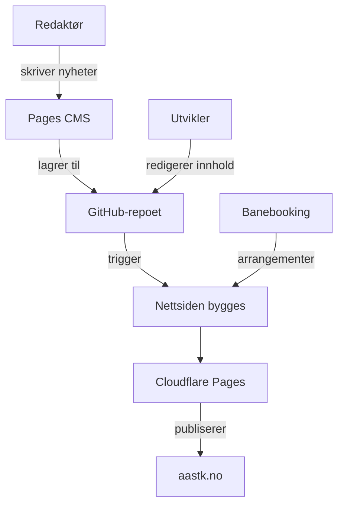

# Ås Tennisklubb – nettside

Dette repoet inneholder klubbens offentlige nettside. Nettsiden viser informasjon om klubben, nyheter, arrangementer, baner, medlemskap og kontakt.

---

## Kort forklart

- **Nettsiden** – klubbens offentlige nettside. Kildekoden ligger i dette repoet.
- **Banebooking** – et eget system for banereservasjon og arrangementer. Nettsiden henter arrangementdata derfra.
- **Pages CMS** – et redigeringsverktøy der redaktører kan skrive og oppdatere nyhetsartikler uten å jobbe i kode.
- **Cloudflare** – domenet (aastk.no) går via Cloudflare, som håndterer publisering og levering av nettsiden.

---

## Hvordan løsningene henger sammen

Nettsiden bygges fra innholdet i dette GitHub-repoet. Ulike typer innhold kommer fra ulike steder:

- **Nyheter** skrives i Pages CMS, som lagrer artiklene tilbake til GitHub-repoet.
- **Arrangementer** opprettes i Banebooking og hentes inn når nettsiden bygges.
- **Fast innhold** (sider som baner, medlemskap, om klubben osv.) redigeres direkte i GitHub-repoet.

Når noe endres – enten en nyhet publiseres via Pages CMS eller en fil oppdateres i repoet – bygger Cloudflare Pages nettsiden på nytt og publiserer den til aastk.no.

I tillegg kjøres det en automatisk nattlig oppdatering som bygger nettsiden på nytt. Det gjør at nye arrangementer fra Banebooking kommer med selv om ingenting annet er endret.



---

## Innhold og redigering

### Nyheter

Nyhetsartikler redigeres via [Pages CMS](https://pagescms.org). Der kan man skrive nye artikler, laste opp bilder og velge kategorier – uten å jobbe direkte i kode. Når en artikkel lagres, havner den som en fil i GitHub-repoet, og nettsiden bygges automatisk på nytt.

### Arrangementer

Arrangementer opprettes og redigeres i Banebooking – ikke på nettsiden. Når nettsiden bygges, henter den inn arrangementene og viser dem på forsiden og arrangementssiden. Nye arrangementer dukker opp ved neste bygg, som skjer automatisk hver natt eller når noe annet endres i repoet.

### Fast innhold

Sider som baner, medlemskap, om klubben og kontakt redigeres direkte i filene i dette GitHub-repoet. Dette krever tilgang til repoet og kjennskap til kodebasen.

---

## Tilgang og roller

Avhengig av hva du skal gjøre, trenger du ulik tilgang:

| Oppgave | Hva du trenger |
| :--- | :--- |
| Opprette eller redigere arrangementer | Administrasjonstilgang i Banebooking |
| Publisere nyheter | Tilgang til Pages CMS (krever GitHub-bruker med tilgang til dette repoet) |
| Endre nettsiden ellers | Skrivetilgang til dette GitHub-repoet |

---

<details>
<summary><strong>For utviklere: lokal utvikling</strong></summary>

```sh
npm install     # Installer avhengigheter
npm run dev     # Start lokal utviklingsserver (localhost:4321)
npm run build   # Bygg nettsiden for produksjon
```

</details>
